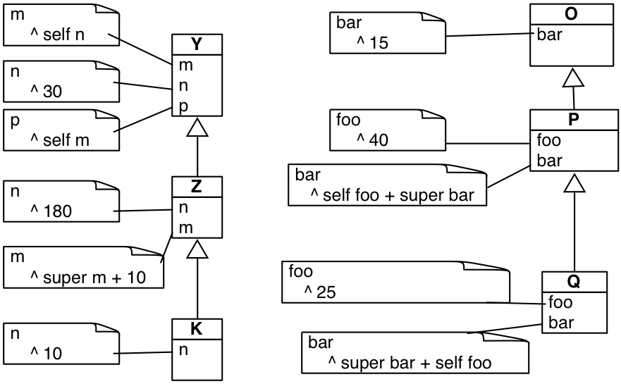

**Teacher**: [Steven Costiou](https://kloum.io/costiou)

**Date** Tuesday 15th october, 2024. 8h30 - 11h45

# Exercises

The objectives of these exercises are to practice concepts covered in the lectures.

There are no explicit exercise about tests: remember that testing should be reflex.
In the following exercices, you must therefore take the initiative of building tests.

## Exercice 15-10-1: Revisiting the Die DSL

You will revisit the Die DSL exercise (from exercice 03-10-4)

Follow the guided instructions of Chapter 8 from the [exercice book](http://rmod-pharo-mooc.lille.inria.fr/AdvancedDesignMooc/2024-04-01-CompanionExercise.pdf).

## Exercice 15-10-2: Self, super and lookups

This is a table exercise on the lookup.

Find, for each of the following expressions, the path and result of the lookup:

- `Z new m`
- `K new p`
- `K new m`
- `Q new bar`
- `P new bar`
 
Note: we want to know exactly where the lookup goes.

## Exercice 15-10-3: Logical gates

TBD

