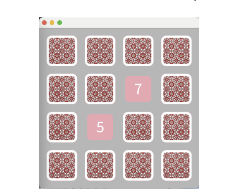

**Teacher**: [Sebastian Jordan Montano](https://github.com/jordanmontt)

**Date** Friday 18th october,  2024. 8h30 - 11h45

## Exercice 17-10-4: A memory game with Bloc

In this guided project, you will implement a [memory game](https://books.pharo.org/booklet-ASimpleMemoryGameInBloc/2024-06-05-ASimpleBlocTutorial.pdf) using Bloc:

### Extras

If you finish the game and you want to add extra features

- Counter of points and turns
- Import png for the cards (using [IconFactory](https://github.com/peteruhnak/IconFactory))
- Add animations for the cards
- "Cheating" feature that allows to turn all the cards by clicing in a button or a key